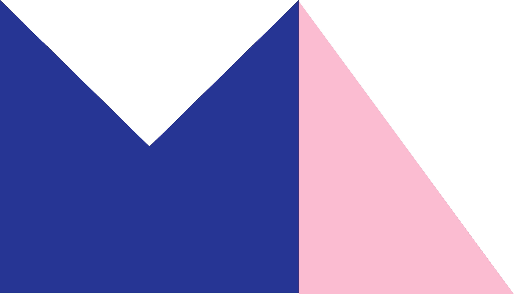

Making visualizations, machine learning, and data analysis easier for you!

<h2>  MLforALL Tech Stack </h2>

_Use the links to view more in-depth `README.md` files throughout the repo._

### [Frontend:](https://github.com/lenghuang/MLforAll/tree/master/frontend/src)

- Materialize-CSS
- Material-UI
- ReactJS
- Redux

### [Backend:](https://github.com/lenghuang/MLforAll/tree/master/api)

- Firebase Authentication, Firestore
- Flask RestAPI
- Google Cloud Platform, Storage
- sci-kit learn
- Pandas

## Links

- [In Progress Testing Link](https://lenghuang.github.io/MLforAll/)
- [Firebase Deployed Link](https://mlforall-14bf7.firebaseapp.com/)
- [Custom Link](https://mlforall.xyz/)
